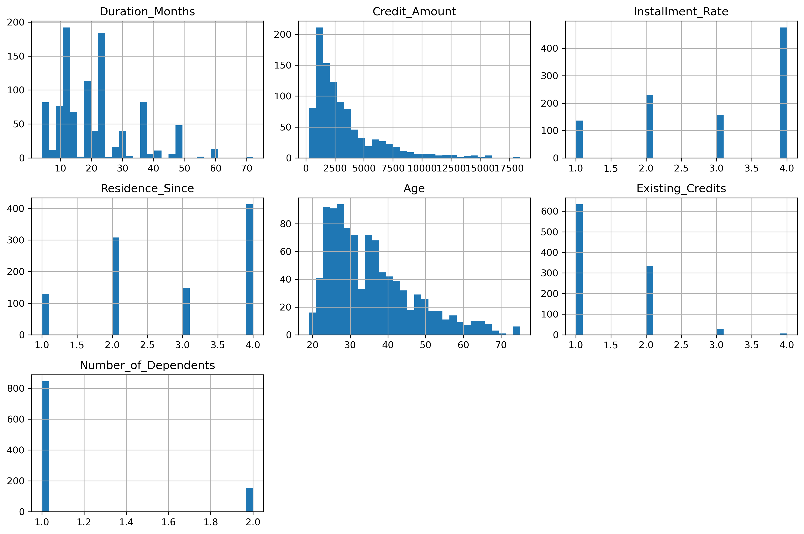
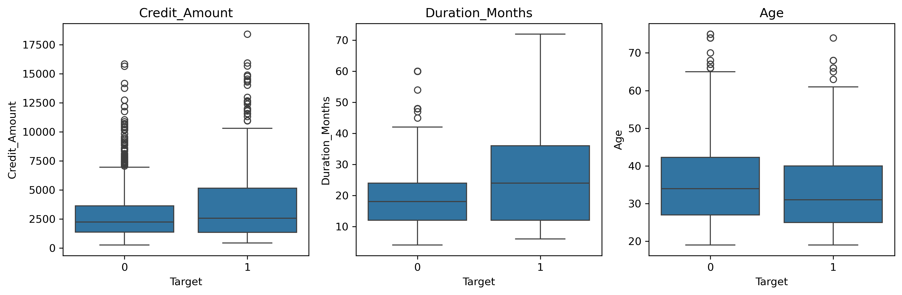
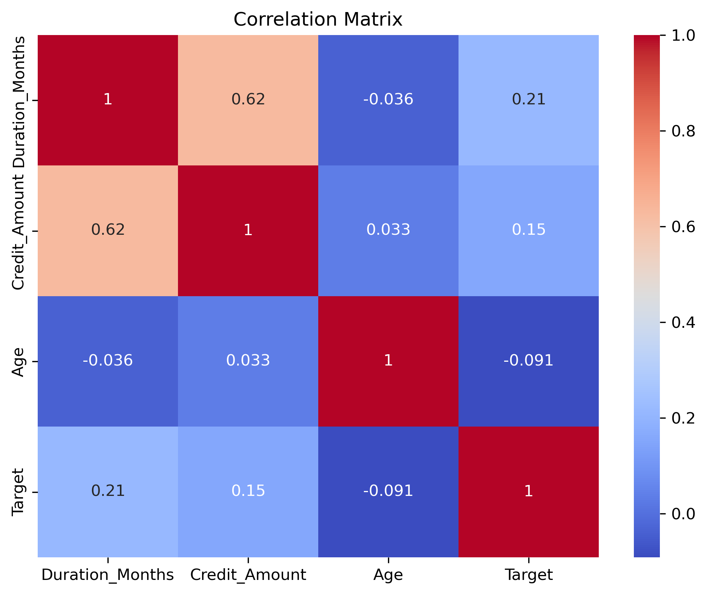
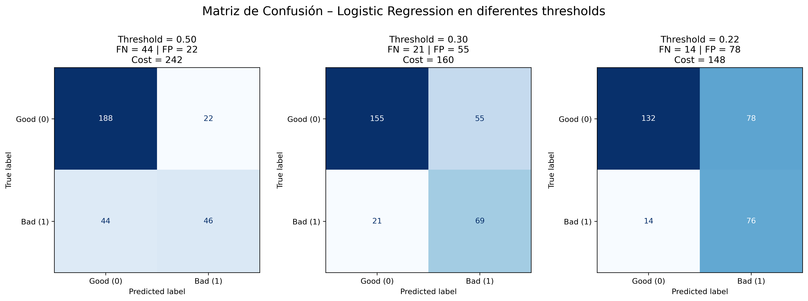
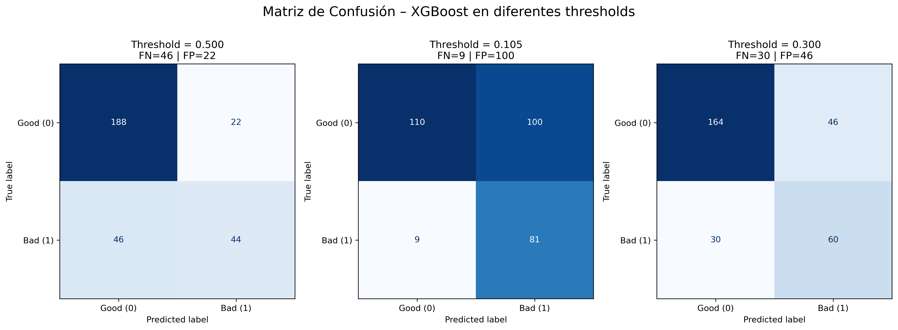
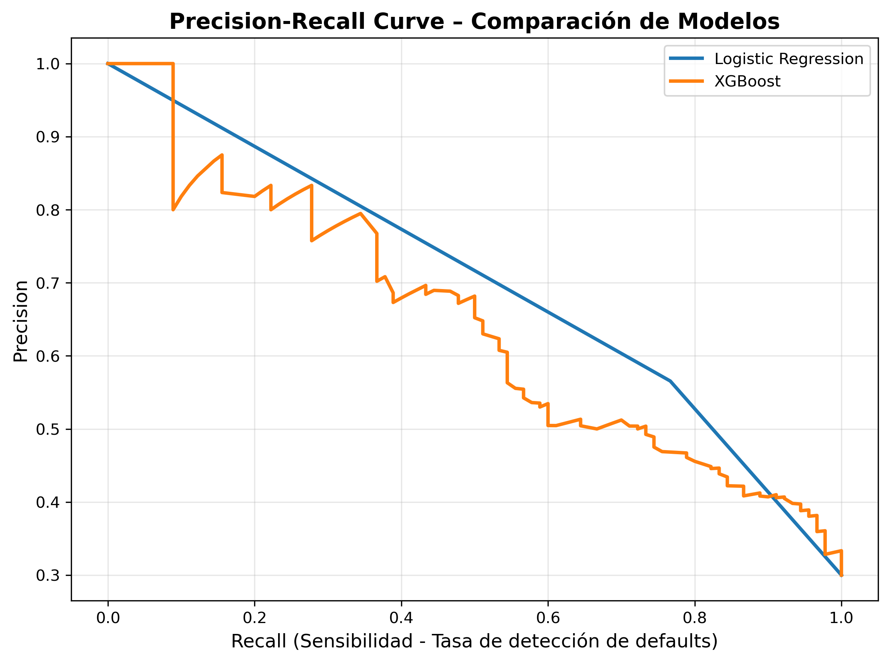
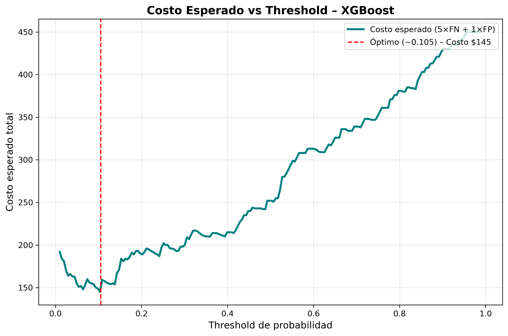

# Credit Risk Modeling: Probability of Default Prediction  
**German Credit Dataset (UCI Machine Learning Repository)**

[](https://www.python.org/)
[](https://opensource.org/licenses/MIT)
[](https://jupyter.org/)

**Proyecto de portafolio** – Transición de docencia (6 años) a analista de datos. Aplicación de estadística aplicada y business intelligence para resolver un problema real de banca: predecir incumplimiento crediticio minimizando pérdidas financieras. 

## 1. Business Problem
Desarrollar un modelo de **Probability of Default (PD)** para apoyar decisiones de aprobación de crédito.  
**Objetivo principal**: Minimizar **pérdidas por falsos negativos** (aprobar clientes riesgosos), alineando el modelo con la función de pérdida del negocio (cost matrix: 5×FN + 1×FP).

**Contexto**: Dataset clásico de riesgo crediticio (1000 observaciones, ~30% default rate). Muy relevante en finanzas, fintech y regulación (e.g., APRA en Australia). 

## 2. Dataset
- Fuente: [UCI Statlog (German Credit Data)](https://archive.ics.uci.edu/dataset/144/statlog+german+credit+data)  
- 1000 instancias, 20 atributos (7 numéricos, 13 categóricos).  
- Target: 1 = Good credit (70%), 2 = Bad credit (30%) → imbalance moderado.  
- Sin valores faltantes.  
- Colinealidad notable: duración y monto del crédito (corr ≈ 0.62).

**Ejemplos de variables clave** (códigos originales mapeados):
- `checking_status`: A11 (< 0 DM), A12 (0–200 DM), A13 (≥200 DM), A14 (sin cuenta).  
- `credit_history`: A30 (sin créditos), A34 (buena historia).  
- `purpose`: A40 (auto nuevo), A43 (TV/radio), A46 (educación), etc.  
- `duration_months`, `credit_amount`, `age`, etc. 
  
## 3. Exploratory Data Analysis (EDA) – Hallazgos clave
- Préstamos de **mayor duración** (>36 meses) → default >50%.  
- **Historial crediticio** tiene alto poder predictivo (e.g., A34 bueno vs A33/A32 peor).  
- Propósitos como **educación (A46)** y **mantenimiento** elevan riesgo moderadamente.  
- Relaciones multivariadas dominan → la relación marginal no explica completamente el comportamiento del target.

   ## ROC Curve Comparison

### Histograma

<p align="center">
  
</p>


 ### Boxplot
<p align="center">
  
</p>

 ### Correlation Matrix
 <p align="center">
  
</p>
## 4. Model Comparison
Modelos evaluados (train-test split + cross-validation estratificada recomendada):

| Modelo              | AUC   | Recall (Default) @0.5 | Notas                              |
|---------------------|-------|-----------------------|------------------------------------|
| Logistic Regression | ~0.80 | ~0.52                 | Mejor estabilidad e interpretabilidad |
| Random Forest       | ~0.79 | –                     | Buen desempeño, pero menos interpretable |
| XGBoost             | ~0.80 | –                     | Similar rango, más sensible a hiperparámetros |

**Logistic Regression** destaca por consistencia y explicabilidad (ideal para banca regulada).

Logistic mostró mejor estabilidad y desempeño consistente.


## 5. Threshold Optimization & Cost-Sensitive Learning
Función de costo: **Cost = 5 × FN + 1 × FP** (basado en UCI cost matrix).

| Modelo              | Threshold | FN   | FP   | Recall (Default) | Cost Total |
|---------------------|-----------|------|------|------------------|------------|
| Logistic (default 0.5) | 0.50    | 43   | 23   | 0.52             | 238        |
| Logistic (F1-opt)   | 0.30      | 42   | 15   | 0.77             | 158        |
| Logistic (Cost-opt) | 0.22      | 14   | 74   | 0.84             | 144        |
| XGBoost (Cost-opt)  | 0.10      | 5    | 910  | 0.90             | 145        |

**Hallazgo**: Threshold ~0.22 minimiza costo esperado → reduce FN drásticamente (mejor alineación

## Visualizaciones clave – Optimización por costo

### Matriz de Confusión – Logistic Regression (Modelo Recomendado)

 <p align="center">
  
   </p>
**Interpretación principal**:
- Threshold 0.50: Alto costo por falsos negativos (43 FN → pérdidas evitables altas).
- Threshold 0.30: Mejora balance F1.
- Threshold 0.22 (óptimo por costo): Minimiza pérdidas esperadas (solo 14 FN), con costo total más bajo.

Este threshold optimizado reduce significativamente el riesgo financiero sin sacrificar excesivamente la oportunidad comercial.

### Comparación con XGBoost – ¿Por qué no se elige?

 <p align="center">
  
</p>
**Observaciones**:
- Con threshold bajo (~0.105) logra recall muy alto (90%), pero genera ~100 falsos positivos → costo similar o peor.
- Requiere rechazar muchos clientes buenos → impacto negativo en volumen de negocio.
- Menor interpretabilidad y estabilidad comparado con Logistic Regression.

**Conclusión**: Aunque XGBoost es potente, Logistic Regression ofrece mejor alineación con objetivos de negocio y regulatorios.

### Otras curvas comparativas

 <p align="center">
  
</p>

 <p align="center">
  
</p>
  
  
*(Opcional: agregar Cost vs Threshold para Logistic si lo generas)*

## 6. Interpretability
Usando **Odds Ratios** de Logistic Regression (exp(coef)):

- `property_A124` (sin propiedad valiosa): OR ≈ 2.27 → mayor riesgo.  
- `purpose_A46` (educación): OR ≈ 1.97.  
- `duration_months`: OR ≈ 1.66 (por cada mes adicional).  
- `installment_rate`: OR ≈ 1.33.

Consistente con teoría financiera: menor colateral, propósitos de consumo no esencial y plazos largos elevan PD.

## 7. Final Recommendation

**Modelo recomendado**: Logistic Regression + threshold optimizado por costo (~0.22).  
Razones:
- AUC sólido (~0.80).  
- Reducción significativa de pérdidas (cost ↓ de 238 → 144).  
- Alta **interpretabilidad** (ORs → fácil explicación a stakeholders).  
- Cumple requisitos regulatorios (explicabilidad).  
- Estabilidad vs overfitting en ensembles.

## 8. Business Implications
- Reduce pérdidas por defaults aprobados accidentalmente.  
- Aumenta rechazos de buenos clientes → trade-off a evaluar con apetito de riesgo y estrategia comercial.  
- Transferible a otros contextos: scoring retail, micropréstamos, BNPL en Australia.

9. Reproducibility:

```bash
pip install -r requirements.txt
jupyter notebook
```

## 9. Reproducibility
```bash
# 1. Clona el repo
pip install -r requirements.txt
jupyter notebook

# 2. Instala dependencias (recomendado virtualenv)
pip install -r requirements.txt

# 3. Ejecuta el notebook principal
jupyter notebook notebooks/credit_risk_analysis.ipynb 
```

## 10. Future Improvements
    
*	Cross-validation con optimización de threshold.
*	Calibración de probabilidades.
*	Tuning avanzado de XGBoost.
*	Análisis de estabilidad temporal.
*	Backtesting en múltiples muestras.

